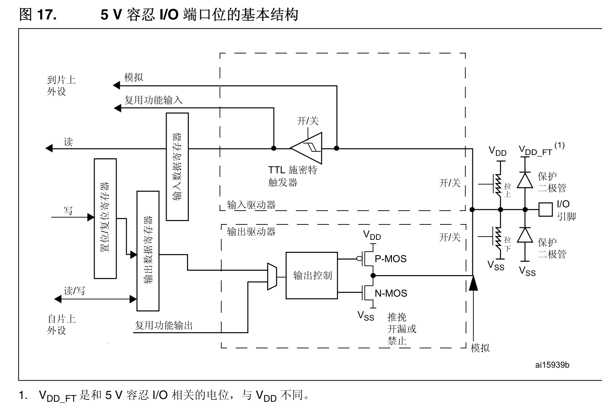
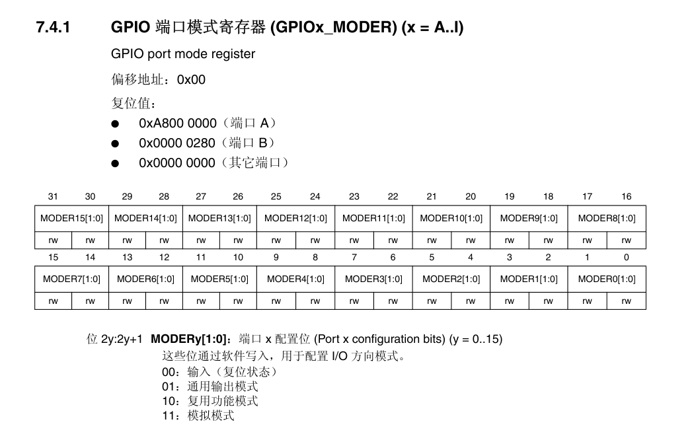
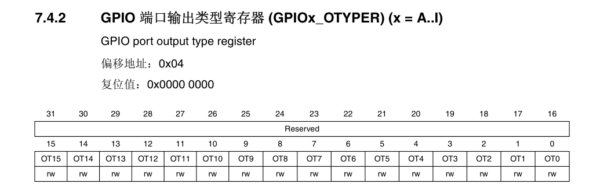
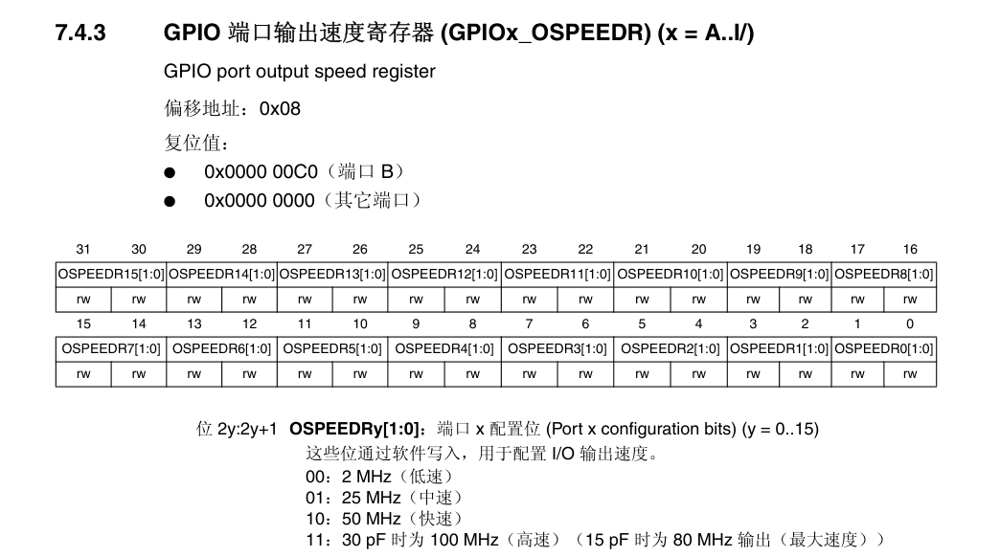

# GPIO 通用输入输出端口详解 (STM32F4/F7/H7 系列 · HAL 库)

> **标签**：#STM32 #GPIO #HAL库 #嵌入式 #外设 #寄存器映射

> **关联笔记**：[[STM32-时钟系统]]、[[STM32-外部中断-EXTI]]、[[STM32-外设概述]]

## 1. 外设概述与应用场景 (Introduction & Use Cases)

### 功能简介

GPIO（General Purpose Input/Output）是单片机最基础的外设，用于直接控制或读取引脚电平，实现与外部电路的数字信号交互。

### 主要特性（STM32F4/F7/H7 系列）

- 每个端口最多 16 个引脚（GPIOA ~ GPIOH/K 等，具体数量依芯片型号而定）
    
- 支持 4 种模式：输入、输出、复用功能、模拟
    
- 输出类型：推挽 (Push-Pull) / 开漏 (Open-Drain)
    
- 输出速度：Low / Medium / High / Very High（最高可达 100 MHz+，视系列而定）
    
- 内部上下拉电阻（约 40 kΩ）
    
- 复用功能（AF0 ~ AF15，最多 16 种复用）
    
- 大部分引脚支持 5V 容忍 (5V-tolerant, FT)
    
- 支持外部中断/事件（通过 EXTI）
    
- 支持配置锁定机制
    

### 典型应用场景

- 控制 LED、继电器、蜂鸣器
    
- 读取按键、开关、传感器数字信号
    
- 软件模拟通信协议（位邦定 Bit-Banging，如软件 I2C/SPI）
    
- 作为外设复用引脚（SPI、USART、I2C、TIM 等）
    

## 2. 硬件原理与内部框图 (Hardware Architecture)

>  

### 内部框图解析

每个引脚的内部结构主要分为三部分：

1. **输入路径**
    
    - 施密特触发器（Schmitt Trigger）将外部模拟信号整形为数字电平
        
    - 可选内部上/下拉电阻
        
    - 数据送入输入数据寄存器 (IDR)
        
2. **输出路径**： 
    
    - 推挽驱动器：P-MOS + N-MOS 组合，可主动输出高/低电平
        
    - 开漏模式：仅 N-MOS 工作，高电平时呈高阻态（需外部上拉）
        
    - 输出速度由驱动电流控制，影响边沿陡峭度和 EMI
        
3. **复用/保护部分**：
    
    - 复用选择器：GPIO 模式下连接输出驱动器，AF 模式下连接外设信号
        
    - 保护二极管：防止引脚电压超出 VDD/VSS，防止静电损坏（但不能承受大电流）
        

数据流向：

- 输出：CPU → ODR/BSRR → 输出驱动器 → 引脚
    
- 输入：引脚 → 施密特触发器 → IDR → CPU
    
- 复用：外设信号 ↔ 复用选择器 ↔ 引脚
    

### 时钟树关联

- GPIO 挂载在 **AHB1** 总线（F4/F7/H7 均如此）
    
- 时钟使能宏：__HAL_RCC_GPIOx_CLK_ENABLE()
    
- 无独立外设时钟频率，所有操作与 AHB 总线同步
    

### 电气特性

- 单引脚最大灌/拉电流：±25 mA（典型值，具体查 Datasheet）
    
- 端口总电流限制：≈120~150 mA
    
- 大部分引脚 5V-tolerant（标 FT），模拟模式下不耐 5V
    
- 速度等级：
    
    - Low：~2 MHz，省电
        
    - Very High：最高可达 100 MHz（H7 系列）
        

## 3. 核心机制：API 与寄存器映射 (Core Mapping: API vs Registers)

本节完整覆盖所有 GPIO 相关寄存器及 HAL 库主要 API 映射。按照参考手册的逻辑，先详细介绍每个寄存器（包括位字段、描述），然后介绍配置或操作该寄存器的 HAL API。  

### 模式与输出类型配置

**关键寄存器**：
- **GPIOx_MODER**（模式寄存器，偏移 0x00，32 位，R/W，重置值视端口而定，如 GPIOA 为 0xA8000000） 
    该寄存器控制每个引脚的模式。每引脚占用 2 位（位 2y+1:2y，y=0-15）。
    >
    
	- 00：输入模式（默认重置后为输入，除特定引脚）。引脚作为数字输入或浮空。
    - 01：通用输出模式。引脚作为数字输出，可通过 ODR 或 BSRR 控制。
        
    - 10：复用功能模式（Alternate Function）。引脚连接到内部外设信号（如 USART、SPI）。需结合 AFRL/AFRH 配置。
        
    - 11：模拟模式。关闭数字输入/输出电路，用于 ADC/DAC 等模拟外设，降低功耗和噪声。
        
- **GPIOx_OTYPER**（输出类型寄存器，偏移 0x04，16 位，R/W，重置值 0x0000）  
    该寄存器控制输出引脚的类型。每引脚占用 1 位（位 y，y=0-15）。仅在 MODER 为输出或复用模式时有效。
    >
    
    - 位 31:16 保留，必须保持复位值。
        
    - 位 15:0 OTy[1:0]：端口 x 配置位 (Port x configuration bits) (y = 0..15)，这些位通过软件写入，用于配置 I/O 端口的输出类型。
	- 0：输出推挽（复位状态）
	- 1：输出开漏
        

**HAL API 映射**：  
HAL 库通过 HAL_GPIO_Init(GPIO_TypeDef *GPIOx, GPIO_InitTypeDef *GPIO_InitStruct) 配置这些寄存器。

- GPIO_InitStruct.Mode 同时设置 MODER 和 OTYPER：
    
    ```c
    GPIO_InitStruct.Mode = GPIO_MODE_OUTPUT_PP;   // MODER=01, OTYPER=0 (推挽输出)  
    GPIO_InitStruct.Mode = GPIO_MODE_OUTPUT_OD;   // MODER=01, OTYPER=1 (开漏输出)  
    GPIO_InitStruct.Mode = GPIO_MODE_AF_PP;       // MODER=10, OTYPER=0 (复用推挽)  
    GPIO_InitStruct.Mode = GPIO_MODE_AF_OD;       // MODER=10, OTYPER=1 (复用开漏)  
    GPIO_InitStruct.Mode = GPIO_MODE_INPUT;       // MODER=00  
    GPIO_InitStruct.Mode = GPIO_MODE_ANALOG;      // MODER=11  
    ```
    

HAL_GPIO_Init() 会根据 Mode 值自动操作 MODER 和 OTYPER 的对应位。

### 输出速度配置

**关键寄存器**：

- **GPIOx_OSPEEDR**（输出速度寄存器，偏移 0x08，32 位，R/W，重置值视端口而定，如 GPIOA 为 0x0C000000）  
>
    
该寄存器控制输出信号的翻转速度（Slew Rate），影响 EMI 和功耗。每引脚占用 2 位（位 2y+1:2y，y=0-15）。仅在 MODER 为输出或复用模式时有效。
    
    - 00：Low speed（≈2 MHz，省电，低 EMI）。
        
    - 01：Medium speed（≈25 MHz）。
        
    - 10：High speed（≈50 MHz）。
        
    - 11：Very High speed（≈100 MHz，视 VDD 而定，高 EMI）。
        

**HAL API 映射**：  
通过 HAL_GPIO_Init() 配置：

```c
GPIO_InitStruct.Speed = GPIO_SPEED_FREQ_LOW;      // OSPEEDR=00  
GPIO_InitStruct.Speed = GPIO_SPEED_FREQ_MEDIUM;   // OSPEEDR=01  
GPIO_InitStruct.Speed = GPIO_SPEED_FREQ_HIGH;     // OSPEEDR=10  
GPIO_InitStruct.Speed = GPIO_SPEED_FREQ_VERY_HIGH;// OSPEEDR=11  
```

HAL_GPIO_Init() 会设置 OSPEEDR 的对应位。

### 上下拉电阻配置

**关键寄存器**：

- **GPIOx_PUPDR**（上下拉寄存器，偏移 0x0C，32 位，R/W，重置值视端口而定，如 GPIOA 为 0x64000000）  
    该寄存器控制内部弱上/下拉电阻（≈40 kΩ）。每引脚占用 2 位（位 2y+1:2y，y=0-15）。在输入或复用模式下有效；在模拟模式下自动禁用。
    
    - 00：无上/下拉（浮空，默认）。
        
    - 01：上拉（接 VDD）。
        
    - 10：下拉（接 VSS）。
        
    - 11：保留（勿用）。
        

**HAL API 映射**：  
通过 HAL_GPIO_Init() 配置：

```c
GPIO_InitStruct.Pull = GPIO_NOPULL;   // PUPDR=00  
GPIO_InitStruct.Pull = GPIO_PULLUP;   // PUPDR=01  
GPIO_InitStruct.Pull = GPIO_PULLDOWN; // PUPDR=10  
```

HAL_GPIO_Init() 会设置 PUPDR 的对应位。

### 复用功能选择 **关键寄存器**：

- **GPIOx_AFRL**（低引脚复用寄存器，偏移 0x20，32 位，R/W，重置值 0x00000000）  
    控制引脚 0-7 的复用功能。每引脚占用 4 位（位 4y+3:4y，y=0-7）。
    
    - 值 0-15：对应 AF0-AF15（AF0 通常为系统功能，AF1-AF15 为外设，如 TIM、USART）。仅在 MODER=10 时有效。
        
- **GPIOx_AFRH**（高引脚复用寄存器，偏移 0x24，32 位，R/W，重置值 0x00000000）  
    控制引脚 8-15 的复用功能。每引脚占用 4 位（位 4(y-8)+3:4(y-8)，y=8-15）。
    
    - 值 0-15：同上。
        

**HAL API 映射**：  
通过 HAL_GPIO_Init() 配置：

```c
GPIO_InitStruct.Alternate = GPIO_AF7_USART1;  // 设置对应 AFRL 或 AFRH 为 7（视引脚而定）  
```

HAL_GPIO_Init() 会根据 Pin 值选择 AFRL 或 AFRH，并设置对应 4 位。

### 数据读写（核心操作寄存器）

   **关键寄存器**：

- **GPIOx_IDR**（输入数据寄存器，偏移 0x10，16 位，只读，重置值未定义）  
    反映每个引脚的当前逻辑电平（低 16 位，位 y=0-15）。每 AHB1 时钟周期采样一次。用于读取输入状态。
    
- **GPIOx_ODR**（输出数据寄存器，偏移 0x14，16 位，R/W，重置值 0x0000）  
    控制输出引脚的逻辑电平（低 16 位，位 y=0-15）。写操作设置输出；读返回上次写值。仅在输出或复用模式有效。
    
- **GPIOx_BSRR**（原子置位/复位寄存器，偏移 0x18，32 位，只写，重置值 0x0000）  
    用于原子操作，避免读-改-写竞争（中断安全）。
    
    - 低 16 位（BSy）：写 1 将引脚 y 置 1（输出高），写 0 无影响。
        
    - 高 16 位（BRy）：写 1 将引脚 y 置 0（输出低），写 0 无影响。
        

**HAL API 映射**：


GPIO_PinState HAL_GPIO_ReadPin(GPIO_TypeDef *GPIOx, uint16_t GPIO_Pin); // 读取 IDR 对应位，返回 GPIO_PIN_SET 或 GPIO_PIN_RESET。

void HAL_GPIO_WritePin(GPIO_TypeDef *GPIOx, uint16_t GPIO_Pin, GPIO_PinState PinState); // 使用 BSRR 置 1 (SET) 或 置 0 (RESET)。` 

void HAL_GPIO_TogglePin(GPIO_TypeDef *GPIOx, uint16_t GPIO_Pin); // 读 ODR 对应位，取反，然后用 BSRR 设置。`

### 配置锁定

![[Pasted image 20260104224332.png]] **关键寄存器**：

- **GPIOx_LCKR**（锁定寄存器，偏移 0x1C，32 位，R/W，重置值 0x0000）  
    用于锁定引脚配置，防止意外修改。低 16 位（LCKy）：写 1 表示锁定引脚 y。位 16（LCKK）：锁定键位。  
    锁定序列：写 LCKR = (LCKy | 0x10000) → 写 LCKR = LCKy → 写 LCKR = (LCKy | 0x10000) → 读 LCKR（应为 LCKy，无 LCKK=1） → 读 LCKR（LCKK=1，表示锁定）。锁定后，MODER、OTYPER、OSPEEDR、PUPDR、AFR 不可改，直到复位。
    

**HAL API 映射**：

- HAL_StatusTypeDef HAL_GPIO_LockPin(GPIO_TypeDef *GPIOx, uint16_t GPIO_Pin); // 执行上述锁定序列，设置 LCKR 并验证。返回 HAL_OK 或 HAL_ERROR。
    

## 4. 高级特性与中断/DMA (Advanced Features & Interrupts/DMA)

### 配置锁定机制

- 用于防止程序跑飞误改关键引脚配置（如电机驱动）
    
- 一旦锁定，相关寄存器冻结直到下次复位
    

### 外部中断/事件（EXTI）

- GPIO 引脚可映射到 16 条 EXTI 线（每线对应同编号引脚，如 PA0/PB0/PC0... → EXTI0）
    
- 中断标志位在 EXTI 外设（EXTI_PR）
    
- 配置方式：结合 SYSCFG_EXTICR 选择引脚来源 + EXTI_IMR/EMR/RTSR/FTSR 使能
    
- HAL 支持：HAL_GPIO_EXTI_IRQHandler()、HAL_GPIO_EXTI_Callback()
    

### DMA 联动

- GPIO 本身不支持 DMA（无数据流请求）
    
- 但在复用模式下（如 TIM 输出 PWM），可通过定时器触发 DMA
    

## 5. 标准配置流程 (Configuration Workflow)

1. **开启时钟**（必须第一步）
    
    ```c
    __HAL_RCC_GPIOA_CLK_ENABLE();
    ```
    
2. **配置 GPIO 结构体**
    
    ```c
    GPIO_InitTypeDef GPIO_InitStruct = {0};
    GPIO_InitStruct.Pin       = GPIO_PIN_5;
    GPIO_InitStruct.Mode      = GPIO_MODE_OUTPUT_PP;
    GPIO_InitStruct.Pull      = GPIO_NOPULL;
    GPIO_InitStruct.Speed     = GPIO_SPEED_FREQ_HIGH;
    GPIO_InitStruct.Alternate = GPIO_AF1_TIM2;  // 如需复用
    ```
    
3. **初始化引脚**
    
    ```c
    HAL_GPIO_Init(GPIOA, &GPIO_InitStruct);
    ```
    
4. **设置初始电平（推荐）**
    
    ```c
    HAL_GPIO_WritePin(GPIOA, GPIO_PIN_5, GPIO_PIN_RESET);
    ```
    
5. **外部中断配置（如需要）**：参考 EXTI 笔记
    

## 6. 常见避坑与调试指南 (Pitfalls & Troubleshooting)

### 常见问题

- **忘记开时钟**：配置无效，引脚保持复位状态（高阻/浮空）
    
- **JTAG/SWD 引脚冲突**：PA13/PA14/PB3/PB4 默认调试接口，配置为 GPIO 后调试器可能无法连接（解决：Connect under reset）
    
- **开漏模式无上拉**：无法输出高电平，LED 不亮
    
- **速度设置过低**：复用高速外设（如 SPI >10MHz）时波形变圆，通信失败
    
- **外部中断死循环**：未及时清除 EXTI_PR 标志位
    

### 调试技巧

- 使用 IDE（STM32CubeIDE/Keil）Peripheral View 实时查看 GPIOx_MODER/IDR/ODR 等寄存器
    
- 万用表测量引脚电压：≈1.5V 通常表示浮空/高阻态
    
- 示波器观察边沿：验证速度设置是否合适
    
- Debug 时单步观察 BSRR 操作是否生效
    

## 7. 示例代码 (Example Code)

### 示例 1：基础轮询 - LED 闪烁（PA5）

```c
void LED_GPIO_Config(void)
{
    __HAL_RCC_GPIOA_CLK_ENABLE();

    GPIO_InitTypeDef GPIO_InitStruct = {0};
    GPIO_InitStruct.Pin   = GPIO_PIN_5;
    GPIO_InitStruct.Mode  = GPIO_MODE_OUTPUT_PP;
    GPIO_InitStruct.Pull  = GPIO_NOPULL;
    GPIO_InitStruct.Speed = GPIO_SPEED_FREQ_LOW;

    HAL_GPIO_Init(GPIOA, &GPIO_InitStruct);
}

// 在主循环中使用
HAL_GPIO_TogglePin(GPIOA, GPIO_PIN_5);
HAL_Delay(500);
```

### 示例 2：按键输入（PC13，上拉输入）

```c
void Key_GPIO_Config(void)
{
    __HAL_RCC_GPIOC_CLK_ENABLE();

    GPIO_InitTypeDef GPIO_InitStruct = {0};
    GPIO_InitStruct.Pin  = GPIO_PIN_13;
    GPIO_InitStruct.Mode = GPIO_MODE_INPUT;
    GPIO_InitStruct.Pull = GPIO_PULLUP;

    HAL_GPIO_Init(GPIOC, &GPIO_InitStruct);
}

// 读取
if (HAL_GPIO_ReadPin(GPIOC, GPIO_PIN_13) == GPIO_PIN_RESET)
{
    // 按键按下
}
```

> **最后更新**：2026-01-03  
> 本笔记适用于 STM32F4/F7/H7 系列，内容来源于官方参考手册 + 实战经验总结。